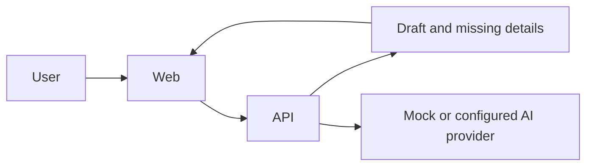

# Simple MVP architecture

ReportFlow is a hackathon demo with a web interface and a small API. The user provides an incident story; the API organizes the supplied details and returns a draft for the user to review.



## Local project layout

```text
project/
├── frontend/   # Web interface
└── backend/    # API and report drafting logic
```

Use the folders and commands present in the codebase. Run the frontend and backend locally in separate terminals. For the demo, use synthetic examples and the mock provider when available.

## MVP behavior

1. Accept an incident story from the user.
2. Organize details and point out missing information.
3. Generate a draft for the user to review and copy.

The app does not submit reports. Keep user data in the local development environment and avoid adding infrastructure that the demo does not need.
