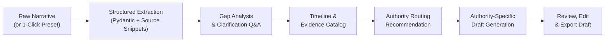

# 🎙️ AWAAZ — Incident Report AI

> **Git Jaipur 2026 Hackathon Prototype | Problem Statement PS04**  
> *Transforming raw, traumatic incident narratives into structured, legally actionable report drafts — with guaranteed zero hallucinations.*

---

## 📌 Problem: The Trauma-to-Bureaucracy Barrier

When victims experience cyber harassment, financial scams, or workplace misconduct, reporting the incident is overwhelming. Official portals (such as the National Cyber Crime Portal or police stations) demand structured timelines, specific transaction IDs, handles, and formal legal phrasing. 

Most victims either submit disjointed, emotional accounts that delay action or abandon reporting altogether. Generic LLM chatbots risk hallucinating dates, legal terms, or suspect details.

**AWAAZ** solves this with an auditable, human-in-the-loop pipeline:
- **Zero Hallucinations:** Every extracted fact is pinned to an exact verbatim source snippet.
- **Proactive Gap Analysis:** Identifies critical missing fields required by official filing schemas before submission.
- **Authority Routing:** Deterministic guidance for appropriate portals (Cybercrime Portal, Local Police / BNS, POSH ICC, Banking Ombudsman).
- **Human-in-the-Loop:** Only user-verified facts and evidence notes populate the final editable draft.
- **Zero-Quota Resilience:** Operates smoothly both with OpenAI (`gpt-4o-mini`) and 100% offline via built-in deterministic local rule extraction.

---

## 🔄 End-to-End Workflow Pipeline



---

## 🚀 Key Features

| Feature | Description |
|---|---|
| **Intake & Demo Presets** | Free-form narrative input up to 20,000 characters with 1-click presets for Cyber Stalking, UPI Fraud, and Workplace POSH. |
| **Source Provenance** | Discrete key-value fact extraction where each detail quotes the exact sentence from the user's account. |
| **Fact Verification** | Interactive toggles allowing users to verify, discard, or edit each extracted fact. |
| **Missing Info Detection** | Identifies critical gaps (e.g., handles, dates, financial amounts) and prompts follow-up questions. |
| **Evidence Organization** | Catalog screenshots, transaction references, chat logs, and links. |
| **Chronological Timeline** | Automatically parses relative milestones into an ordered sequence of events. |
| **Jurisdictional Routing** | Recommends official filing channels with clear rationale and official portal tags. |
| **Template Drafting** | Generates formal drafts tailored to Police FIRs, Cyber Crime Portals, Banks, or Workplace Committees. |

---

## 🗂️ Project Structure

```text
.
├── backend/
│   ├── app/
│   │   ├── main.py              # FastAPI endpoints & session state
│   │   ├── extraction.py        # OpenAI structured extraction + local fallback engine
│   │   ├── drafting.py          # Authority-specific complaint draft generator
│   │   ├── missing_info.py      # Rule-based gap & dependency analysis
│   │   ├── routing.py           # Jurisdictional route recommendation engine
│   │   ├── demo_data.py         # Synthetic demo scenarios & presets
│   │   └── models.py            # Pydantic data schemas
│   ├── tests/                   # Backend test suite (pytest)
│   └── requirements.txt
├── frontend/
│   ├── src/
│   │   ├── pages/               # Multi-step wizard screens (Intake, Analysis, Summary, etc.)
│   │   ├── layout/              # Header, footer, and navigation
│   │   ├── components/          # Reusable UI cards and frame components
│   │   ├── services.js          # REST client communicating with FastAPI
│   │   └── style.css            # Custom responsive design system
│   └── package.json
└── PS04_Incident_Report_AI_Development_Docs/  # Hackathon problem statement & specifications
```

---

## ⚡ Quick Start & Local Setup

### Prerequisites
- **Python 3.10+**
- **Node.js 18+** & **npm**

---

### 1. Backend Setup (FastAPI)

In your first terminal:

```bash
cd backend

# Create and activate virtual environment
python3 -m venv .venv
source .venv/bin/activate

# Install dependencies
pip install -r requirements.txt

# (Optional) Set OpenAI API Key for live LLM extraction:
export OPENAI_API_KEY="your-api-key"
export OPENAI_MODEL="gpt-4o-mini"  # default

# Start the API server
uvicorn app.main:app --reload --host 0.0.0.0 --port 8000
```

> **Note on Offline / Zero-Quota Demo:**  
> If `OPENAI_API_KEY` is not set, AWAAZ automatically falls back to the deterministic local rule extraction engine. All presets and manual narratives remain fully functional with zero API latency.

---

### 2. Frontend Setup (React + Vite)

In your second terminal:

```bash
cd frontend

# Install dependencies
npm install

# Start the Vite development server
npm run dev
```

Visit the frontend URL printed by Vite (typically `http://localhost:5173`). The frontend connects to the backend at `http://localhost:8000`.

---

## 🧪 Running Tests

To verify backend endpoints and extraction flows:

```bash
cd backend
source .venv/bin/activate
pytest tests/
```

---

## 📋 REST API Endpoints Overview

| Method | Endpoint | Description |
|---|---|---|
| `GET` | `/api/health` | Health check |
| `POST` | `/api/reports` | Create new incident report session |
| `GET` | `/api/reports/{id}` | Retrieve report details |
| `POST` | `/api/reports/{id}/analyze` | Trigger structured extraction & gap analysis |
| `PATCH` | `/api/reports/{id}/facts/{fact_id}` | Toggle verification status of an extracted fact |
| `PATCH` | `/api/reports/{id}/answers/{field}` | Ingest answers to follow-up questions |
| `POST` | `/api/reports/{id}/evidence` | Add evidence note (screenshot, reference, etc.) |
| `POST` | `/api/reports/{id}/drafts` | Generate authority-specific complaint draft |
| `PATCH` | `/api/reports/{id}/drafts/{draft_id}` | Update draft content with user edits |
| `GET` | `/api/demo/narratives` | Fetch synthetic demo scenario presets |

---

## ⚖️ Legal & Privacy Disclaimer

- **Local Session Storage:** Reports and drafts are maintained in-memory for hackathon demonstration. No personal data is stored in persistent databases or sent to third parties without configured API credentials.
- **Not Legal Counsel:** AWAAZ is an administrative documentation assistant designed to structure information. It does not file reports directly with authorities or provide legal advice.
